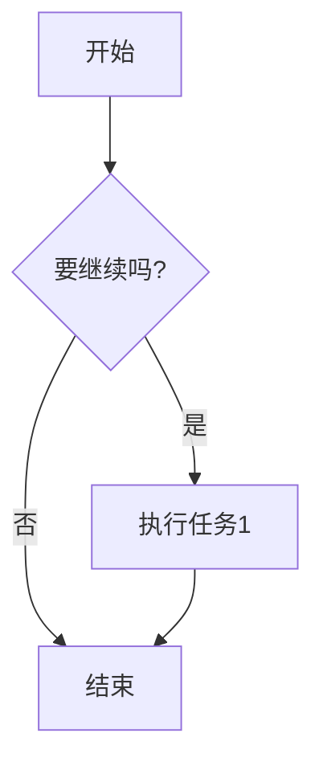
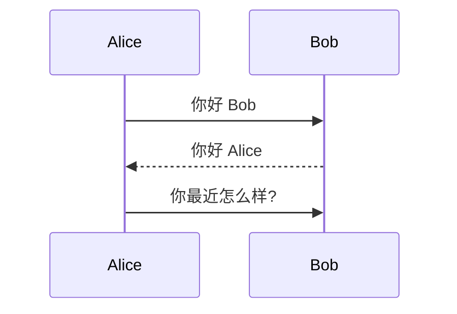
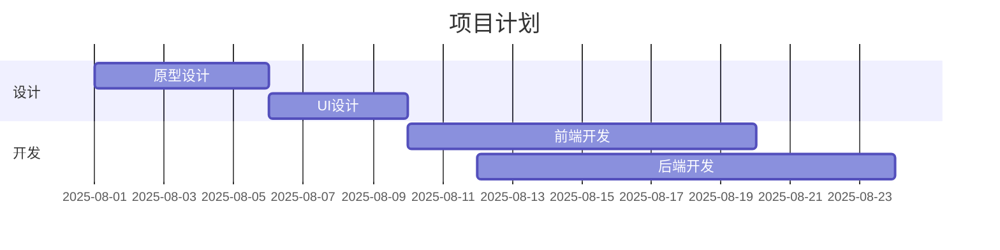
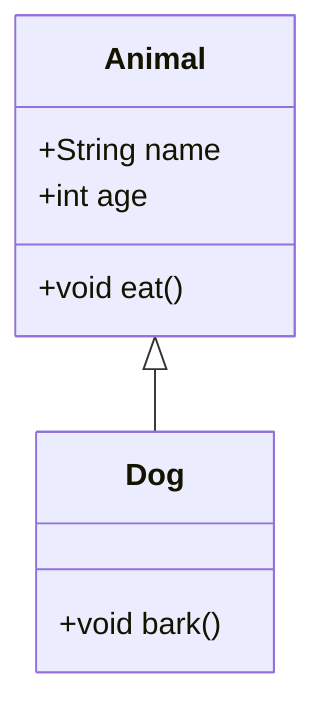
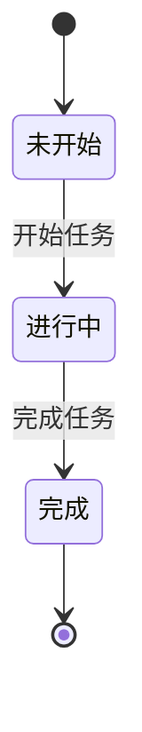
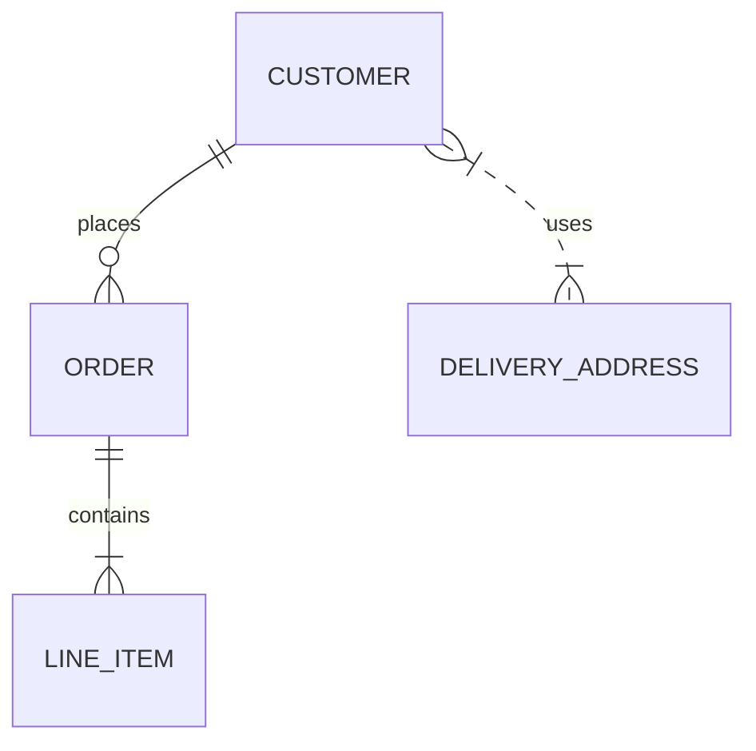

# 🎯 标题测试
这是一个 **Markdown** 测试文件，包含各种常见扩展。

## 📋 任务列表 (Task List)
- [x] 完成基本测试
- [ ] 等待结果
- [ ] ~~取消的任务~~

## 📊 表格测试 (GFM Table)

| 编号 | 名称     | 数量 | 单价 (¥) |
| ---- | -------- | ---- | -------- |
| 1    | 🍎 苹果  |  5   |  3.50    |
| 2    | 🍌 香蕉  |  8   |  2.80    |
| 3    | 🥭 芒果  |  2   |  6.20    |
| **合计** | — | **15** | **??** |

## 🔢 上下标 / 高亮
化学式：H~2~O  
数学：E = mc^2^  
高亮：==这是一句重点==

## 📎 脚注 (Footnote)
这里有一个脚注[^1]，再来一个脚注[^longnote]。

[^1]: 这是第一个脚注内容。
[^longnote]: 这是一个比较长的脚注，用来测试渲染效果是否正常。

## 🧮 数学公式 (KaTeX)
行内公式：$a^2 + b^2 = c^2$  
块级公式：

$$
\frac{\partial f}{\partial x} = 2x + y
$$

## 💻 代码高亮 (Code Highlight)
```js
// JavaScript 示例
function greet(name) {
    console.log(`你好, ${name}！`);
}
greet("Markdown");
```

```python
# Python 示例
def add(a, b):
    return a + b

print(add(2, 3))
```

## 📈 Mermaid 图表








## 😄 Emoji / 表情
这是一些表情测试：😀 😍 🎉 🚀

> 块引用测试：  
> Markdown 真是好玩！

---

### 🎨 自定义容器（需要 markdown-it-container 支持）
::: info
这里是一个提示容器，可以放一些说明文字。
:::
